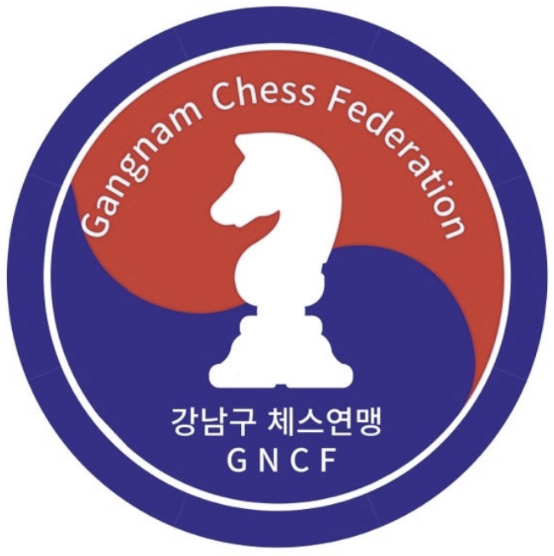

# 강남구 체스 연맹 홈페이지

강남구 체스 연맹 홈페이지 제작 프로젝트입니다.
이 홈페이지는 강남구 체스 연맹의 소개, 공지, 엘리트 선수단, 청소년 위원회, 회원 혜택 정보를 방문자에게 보기 쉽게 전달하는 것을 목표로 합니다.

---

## 1. 프로젝트 목표

이 프로젝트의 목표는 처음 방문한 사람이 홈페이지에 들어왔을 때 중요한 정보를 빠르게 확인할 수 있도록 하는 것입니다.

홈페이지 첫 화면에는 모든 정보를 한 번에 넣지 않고, 중요한 정보만 요약해서 보여줍니다.
자세한 내용은 각 개별 페이지에서 확인할 수 있도록 구성합니다.

### 핵심 목표

* 최신 공지 확인
* 강남구 체스 연맹 소개
* 엘리트 선수단 안내
* 청소년 위원회 활동 소개
* 회원 혜택 안내
* 스폰서 정보 표시
* 각 섹션을 개별 페이지로 분리

---

## 2. 디자인 방향

홈페이지 디자인은 너무 딱딱한 공식 페이지 느낌보다는, 밝고 접근하기 쉬운 커뮤니티형 스포츠 단체 홈페이지 느낌을 목표로 합니다.

### 디자인 키워드

* 파란색과 빨간색 중심의 색상
* 둥근 카드형 레이아웃
* 깔끔한 흰색 배경
* 부드러운 그림자
* 청소년과 커뮤니티 느낌
* 너무 공식적이지 않은 친근한 분위기

### 주요 색상

```css
--blue: #0647b8;
--blue-dark: #002b75;
--red: #e5252a;
--red-dark: #b9161c;
--white: #ffffff;
--black: #111827;
--gray: #6b7280;
```

---

## 3. 사용 기술

현재 프로젝트는 처음 홈페이지를 만드는 단계이므로, 복잡한 프레임워크 없이 기본 웹 기술로 제작합니다.

* HTML
* CSS
* JavaScript
* Git
* GitHub Pages

추후 필요에 따라 React, Next.js, Firebase 등의 기술을 추가할 수 있습니다.

---

## 4. 페이지 구조

처음에는 원페이지 스크롤 방식으로 생각했지만, 최종적으로는 각 섹션의 자세한 내용을 개별 페이지로 분리하는 구조로 변경했습니다.

```txt
index.html          ← 홈페이지, 중요한 정보만 표시
about.html          ← 강남구 체스 연맹 소개
elite.html          ← 엘리트 선수단 소개
youth.html          ← 청소년 위원회 소개
benefits.html       ← 회원 혜택 안내
notice.html         ← 전체 공지 및 뉴스
style.css           ← 전체 디자인
script.js           ← 동작 기능
images/             ← 이미지 파일
```

---

## 5. 홈페이지 구성

`index.html`은 홈페이지의 메인 화면입니다.
모든 내용을 길게 보여주는 방식이 아니라, 중요한 정보만 요약해서 보여줍니다.

### 홈페이지 우선순위

1. 최근 공지
2. 간단한 연맹 소개
3. 주요 페이지 미리보기
4. 스폰서
5. Footer

### 홈페이지에 들어가는 내용

* 메인 소개 문구
* 최신 공지 카드
* 소개 페이지 이동 카드
* 엘리트 선수단 페이지 이동 카드
* 청소년 위원회 페이지 이동 카드
* 회원 혜택 페이지 이동 카드
* 스폰서 목록
* 연락처 및 SNS Footer

---

## 6. 개별 페이지 설명

### `about.html`

강남구 체스 연맹 소개 페이지입니다.

포함 내용:

* 강남구 체스 연맹은 무엇인가?
* Who
* What
* Why
* How
* When
* 연맹 목표
* 체스 보급
* 대회 운영
* 청소년 성장

---

### `elite.html`

엘리트 선수단 소개 페이지입니다.

포함 내용:

* 엘리트 선수단 소개
* 선수단 사진
* 대회 이력
* Olympiad
* Kadet
* League
* 정기 훈련
* 대회 참가
* 성장 관리

---

### `youth.html`

청소년 위원회 소개 페이지입니다.

포함 내용:

* 청소년 위원회 소개
* 청소년 위원회 활동 목적
* 남수단 기부 활동
* 봉사 활동
* 청소년 리더십
* 교류 활동
* 성장 프로그램

---

### `benefits.html`

회원 혜택 안내 페이지입니다.

포함 내용:

* 회원 혜택 소개
* 대회 활동 기회
* 행사 참여
* 선수 지원
* 가입 및 문의 QR 코드
* 바로가기 버튼

---

### `notice.html`

전체 공지 및 뉴스 페이지입니다.

홈페이지에는 최신 공지만 간단히 보여주고, 나머지 공지들은 이 페이지에서 확인할 수 있도록 합니다.

포함 내용:

* 전체 공지
* 대회 공지
* 업데이트 / 뉴스
* 청소년 위원회 소식
* 엘리트 선수단 소식
* 행사 안내

---

## 7. 네비게이션 구조

기존에는 한 페이지 안에서 섹션으로 이동하는 방식이었습니다.

```html
<a href="#notice">공지</a>
<a href="#about">소개</a>
```

최종 구조에서는 각 페이지로 이동합니다.

```html
<a href="notice.html">공지</a>
<a href="about.html">소개</a>
<a href="elite.html">엘리트 선수단</a>
<a href="youth.html">청소년 위원회</a>
<a href="benefits.html">회원 혜택</a>
```

---

## 8. 파일 구조

```txt
gangnam-chess-site/
├── index.html
├── about.html
├── elite.html
├── youth.html
├── benefits.html
├── notice.html
├── style.css
├── script.js
└── images/
    ├── logo.png
    ├── hero.jpg
    ├── about.jpg
    ├── elite-team.jpg
    ├── youth-committee.jpg
    ├── donation.jpg
    ├── benefits.jpg
    └── qr.png
```

---

## 9. 이미지 폴더 설명

현재 프로젝트에서는 `assets` 폴더 대신 `images` 폴더를 사용합니다.

`assets`는 이미지, 아이콘, 폰트, 파일 등을 모아두는 폴더를 의미합니다.
하지만 첫 홈페이지 제작 단계에서는 구조를 단순하게 유지하기 위해 `images` 폴더만 사용합니다.

예시:

```html

```

---

## 10. JavaScript 기능

`script.js`에는 다음 기능들이 들어갑니다.

### 1. 부드러운 스크롤

홈페이지 안에서 `#latest-notice` 같은 섹션으로 이동할 때 부드럽게 이동합니다.

### 2. 공지 카드 가로 스크롤

홈페이지의 최신 공지 영역은 가로 스크롤 카드 형식으로 구성됩니다.

기능:

* 마우스 휠로 가로 이동
* 마우스로 드래그해서 이동
* 카드형 공지 UI

### 3. Header 그림자 효과

페이지를 아래로 스크롤하면 Header에 그림자가 생겨서 상단 메뉴가 더 잘 보이게 합니다.

---

## 11. CSS 방향

`style.css`는 전체 페이지에서 공통으로 사용됩니다.

포함되는 디자인 요소:

* Header
* Navigation
* Button
* Hero section
* Notice card
* About card
* Elite team layout
* Youth committee layout
* Benefit card
* Sponsor section
* Footer
* Responsive design

반응형 디자인도 포함되어 있어서 모바일 화면에서도 볼 수 있도록 구성합니다.

---

## 12. 스폰서 목록

홈페이지 하단에는 스폰서를 표시합니다.

스폰서:

* 대한체육회
* 서울특별시체육회
* 강남구체육회
* 대한체스 연맹

---

## 13. 개발 계획

### 1단계: 기본 파일 생성

먼저 프로젝트 폴더를 만들고 기본 파일을 생성합니다.

```txt
index.html
about.html
elite.html
youth.html
benefits.html
notice.html
style.css
script.js
images/
```

---

### 2단계: HTML 구조 작성

각 페이지의 HTML을 작성합니다.

목표:

* Header 연결
* 각 페이지 이동 링크 연결
* Footer 공통 구조 작성
* 이미지 경로 연결
* 주요 콘텐츠 배치

---

### 3단계: CSS 적용

디자인을 적용합니다.

목표:

* 파란색, 빨간색 중심 컬러 적용
* 카드형 디자인 적용
* 공지 가로 스크롤 디자인 적용
* 반응형 디자인 적용
* Footer 디자인 적용

---

### 4단계: JavaScript 적용

동작 기능을 추가합니다.

목표:

* 공지 카드 가로 스크롤
* 마우스 드래그 스크롤
* Header 그림자 효과
* 부드러운 이동

---

### 5단계: 이미지 교체

임시 이미지 대신 실제 이미지로 교체합니다.

필요한 이미지:

* 로고
* 메인 체스 이미지
* 연맹 소개 이미지
* 엘리트 선수단 이미지
* 청소년 위원회 이미지
* 남수단 기부 활동 이미지
* 회원 혜택 이미지
* QR 코드

---

### 6단계: 모바일 확인

모바일 화면에서도 잘 보이는지 확인합니다.

확인할 것:

* 메뉴가 너무 좁지 않은지
* 카드가 한 줄로 잘 정렬되는지
* 이미지가 깨지지 않는지
* 버튼이 누르기 편한지
* 공지 카드 스크롤이 잘 되는지

---

### 7단계: GitHub 연결

로컬 폴더와 GitHub repository를 연결합니다.

처음 연결할 때:

```bash
git init
git add .
git commit -m "Initial commit"
git remote add origin https://github.com/USERNAME/REPOSITORY_NAME.git
git branch -M main
git push -u origin main
```

이후 수정 후 다시 업로드할 때:

```bash
git add .
git commit -m "Update website"
git push
```

---

### 8단계: GitHub Pages 배포

GitHub Pages를 사용하면 무료로 홈페이지를 배포할 수 있습니다.

진행 순서:

1. GitHub repository 접속
2. Settings 클릭
3. Pages 클릭
4. Branch를 `main`으로 설정
5. 저장
6. 생성된 링크로 접속

---

## 14. 현재 버전의 목표

현재 버전은 완벽한 기능형 사이트가 아니라, 연맹 소개용 정적 홈페이지입니다.

현재 목표:

* 홈페이지 첫 화면 완성
* 각 페이지 연결
* 공지 페이지 분리
* 소개, 선수단, 위원회, 혜택 페이지 분리
* 디자인 색상 통일
* GitHub Pages 배포

---

## 15. 나중에 추가할 기능

현재는 처음 제작 단계이므로 복잡한 기능은 넣지 않습니다.

나중에 추가할 수 있는 기능:

* 공지 상세 페이지
* 실제 게시판 기능
* 관리자 페이지
* 대회 신청 폼
* 사진 갤러리
* 선수 프로필 상세 페이지
* 영어 페이지
* 모바일 메뉴 버튼
* 검색 기능

---

## 16. 실행 방법

프로젝트 폴더에서 `index.html` 파일을 브라우저로 열면 확인할 수 있습니다.

더 편하게 확인하려면 VS Code의 Live Server 확장 프로그램을 사용할 수 있습니다.

실행 방법:

1. VS Code에서 프로젝트 폴더 열기
2. `index.html` 우클릭
3. `Open with Live Server` 클릭
4. 브라우저에서 홈페이지 확인

---

## 17. 프로젝트 요약

강남구 체스 연맹 홈페이지는 방문자에게 필요한 정보를 빠르게 전달하는 것을 목표로 합니다.

첫 화면에는 모든 정보를 넣지 않고 최신 공지와 중요한 요약만 보여줍니다.
자세한 정보는 각각의 개별 페이지에서 확인할 수 있도록 구성합니다.

이 구조는 처음 홈페이지를 만드는 사람도 관리하기 쉽고, 나중에 기능을 확장하기에도 좋습니다.
